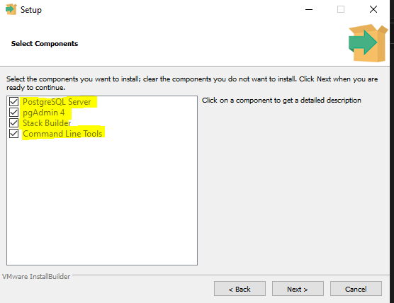
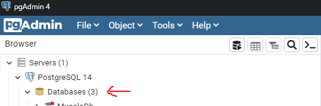
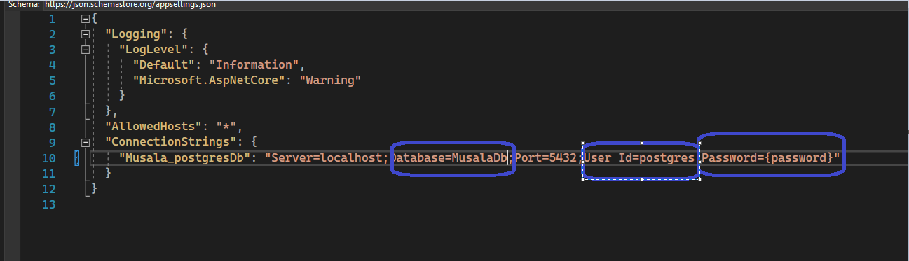

# Musala
## REST APIs project that shows CRUD operation on several different objects using PostgreSQL

### Instructions to run the app

#### 1- Installing the database

- Musala application uses PostgreSQL as a database, therefore in order to run the project successfully you need to download the PostgreSQL.
- Please find the following link to download PostgreSQL version 14.5.
https://www.enterprisedb.com/downloads/postgres-postgresql-downloads
- Make sure that you've selected all available options in installation

#### 2- Setup your database
- Please open the PgAdmin application(GUI for PostgreSQL) and the app will ask you to create a user and password.
- Once you created your user, it's time to create a new database. Expand your `Postgre SQL 14` instance and right click the `Databases` -> Create

- Enter your database name and click `Save`
- Your database instance has been created successfully. It's time to configure your database with script that I created for you. This .sql script contains some seed file and configuration to create your tables. 
- `Right Click` on your `MusalaDb database instance` and select `Query Tool`, and in the query tool open or copy paste the `DatabaseCreator.sql` file in your repository.
- Run the script

#### 3- Edit the appsettings.json file
- Open your Musala.sln and go to appsettings.json file
- Please configure your PostgreSQL user credentials(your username and password) and database name(in my case it's MusalaDb)

You're ready to go :)

### Design Decisions

Please find the list of design decisions that I've been made during the development of application

- `Lightweight` drones can carry maximum 200 gr of items
- `Middleweight` drones can carry maximum 300 gr of items
- `Cruiserweight` drones can carry maximum 400 gr of items
- `Heavyweight` drones can carry maximum 500 gr of items

- Only `IDLE` and `LOADED` stated drones can be loaded with items

- Every loading process will consume `%10` of drone's battery
- Drone that has less then `%25` battery is not loadable

### This service will allows you to 

The service should allow:
- registering a drone;
- loading a drone with medication items;
- checking loaded medication items for a given drone; 
- checking available drones for loading;
- check drone battery level for a given drone;

# VERY USEFUL NOTE
- I created a list of API calls for you to test the app easily and smoothly. Please find the `Musala.postman_collection.json` file which is located in the repository `Installiaton/Musala.postman_collection.json`
- Import the json file to your Postman and test all of the API endpoints freely.
- You can read the `documentation` of Postman collection to see how to use API endpoints
